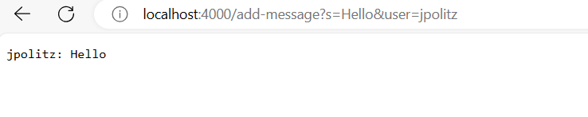
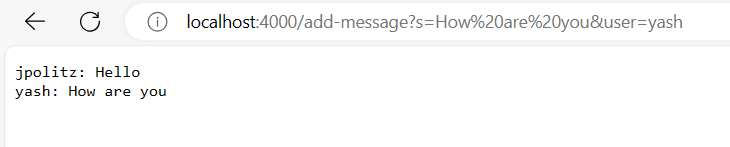
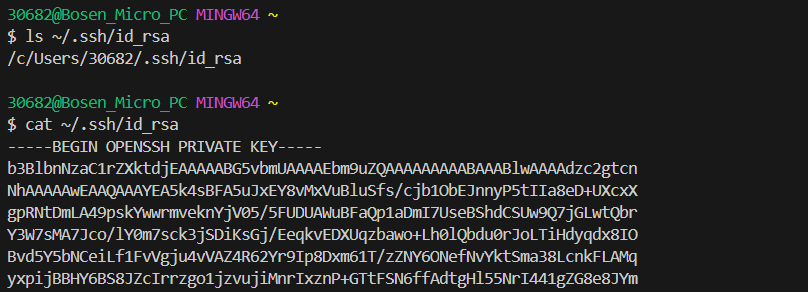
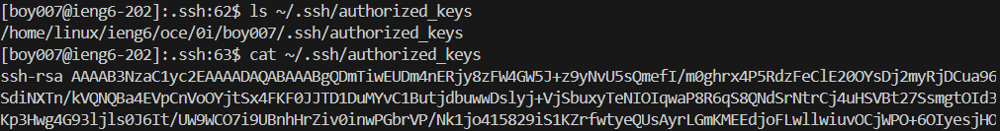
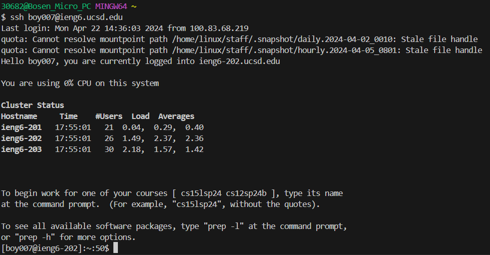

# Part 1
## **Here is the code for my ChatServer.java**
```
import java.io.IOException;
import java.net.URI;
import java.nio.file.Files;
import java.nio.file.Paths;
import java.util.List;

class ChatHandler implements URLHandler{
    List<String> lines;
    String path;

    //constructor
    ChatHandler() throws IOException {
        this.path = "Chat.txt";
        this.lines = Files.readAllLines(Paths.get(path));
    }

    String greeting = null;
    String name = null;
    public String handleRequest(URI url) throws IOException{
        String query = url.getQuery();
        if(url.getPath().equals("/add-message")){
            if(query.startsWith("s=")){
                String secondPart[] = query.split("=", 2);
                String[] parameters = secondPart[1].split("&user=", 2);
                greeting = parameters[0];
                name = parameters[1];

                //store conversations in lines
                String Conversation = String.format("%s: %s", name, greeting);  
                this.lines.add(Conversation);

                //result contains all conversations in lines
                String result = "";
                for(String s: lines) {
                    result += s + "\n";
                }
                return result;
            }
        }
        return "404 Not Found";
    }
}

public class ChatServer{
    public static void main(String[] args) throws IOException{
        if(args.length == 0){
            System.out.println("Please enter a port number!");
            return;
        }

        int portNum = Integer.parseInt(args[0]);
        Server.start(portNum, new ChatHandler());
    }
}
```
## **Here is the code for Server.java, which is identical to Server.java on Prairie Learn**

```
import java.io.IOException;
import java.io.OutputStream;
import java.net.InetSocketAddress;
import java.net.URI;

import com.sun.net.httpserver.HttpExchange;
import com.sun.net.httpserver.HttpHandler;
import com.sun.net.httpserver.HttpServer;

interface URLHandler {
    String handleRequest(URI url) throws Exception;
}

class ServerHttpHandler implements HttpHandler {
    URLHandler handler;
    ServerHttpHandler(URLHandler handler) {
      this.handler = handler;
    }
    public void handle(final HttpExchange exchange) throws IOException {
        // form return body after being handled by program
        try {
            String ret = handler.handleRequest(exchange.getRequestURI());
            // form the return string and write it on the browser
            exchange.sendResponseHeaders(200, ret.getBytes().length);
            OutputStream os = exchange.getResponseBody();
            os.write(ret.getBytes());
            os.close();
        } catch(Exception e) {
            String response = e.toString();
            exchange.sendResponseHeaders(500, response.getBytes().length);
            OutputStream os = exchange.getResponseBody();
            os.write(response.getBytes());
            os.close();
        }
    }
}

public class Server {
    public static void start(int port, URLHandler handler) throws IOException {
        HttpServer server = HttpServer.create(new InetSocketAddress(port), 0);

        //create request entrypoint
        server.createContext("/", new ServerHttpHandler(handler));

        //start the server
        server.start();
        System.out.println("Server started! Access on PrairieLearn through the 'ports' button next to the Terminal tab.");
        System.out.println("Or, to access locally from a terminal on this computer, use http://localhost:" + port + " )");
    }
}
```
## **Example 1: This is the first time I request /add-message**


**Question: Which methods in your code are called?**

Answer: handleRequest method in the ChatHandler class is called.

**Question: What are the relevant arguments to those methods, and the values of any relevant fields of the class?**

Answer: url is passed in as an argument, path, lines, greeting, name are fields in my ChatHandler class.

**Question: How do the values of any relevant fields of the class change from this specific request? If no values got changed, explain why.**

Answer: lines changes to {"jpolitz: Hello"}, greeting changes to "Hello", name changes to "jpolitz". path does not change and is "Chat.txt", because handleRequest method which is called does not modify its value.

## **Example 2: This is the second time I request /add-message**


**Question: Which methods in your code are called?**

Answer: handleRequest method in the ChatHandler class is called.

**Question: What are the relevant arguments to those methods, and the values of any relevant fields of the class?**

Answer: url is passed in as an argument, path, lines, greeting, name are fields in my ChatHandler class.

**Question: How do the values of any relevant fields of the class change from this specific request? If no values got changed, explain why.**

Answer: `lines` changes to `{"jpolitz: Hello", "yash: How are you"}`, `greeting` changes to `"How are you"`, `name` changes to `"yash"`. `path` does not change and is `"Chat.txt"`, because handleRequest method which is called does not modify its value.


## ****
# Part 2
## **Here is `ls` command of absolute path to my private key on my computer. I also displayed a part of the content using `cat` command**


## **Here is `ls` command of absolute path to the public key on ieng6 server. I also displayed a part of the content using `cat` command**


## **This is I access the server without being asked to enter a password**


# Part 3
## **In week 2, I learned how to build a web server.**
**I learned using `curl` command with an localhost argument to run the web server in terminal. I also learned how to read the code and passing more arguments with the query mark.**

## **In week 3, I learned tester library and JUnit package**
**I learned how to add `@Test` annotation before each test case. I also learned useing `assertEqual()` to verify the actual output and my expected output.**
